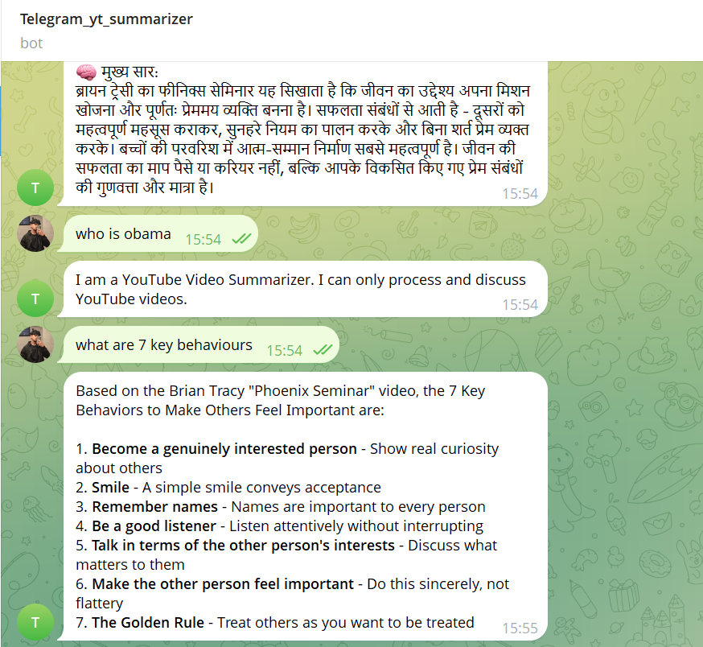
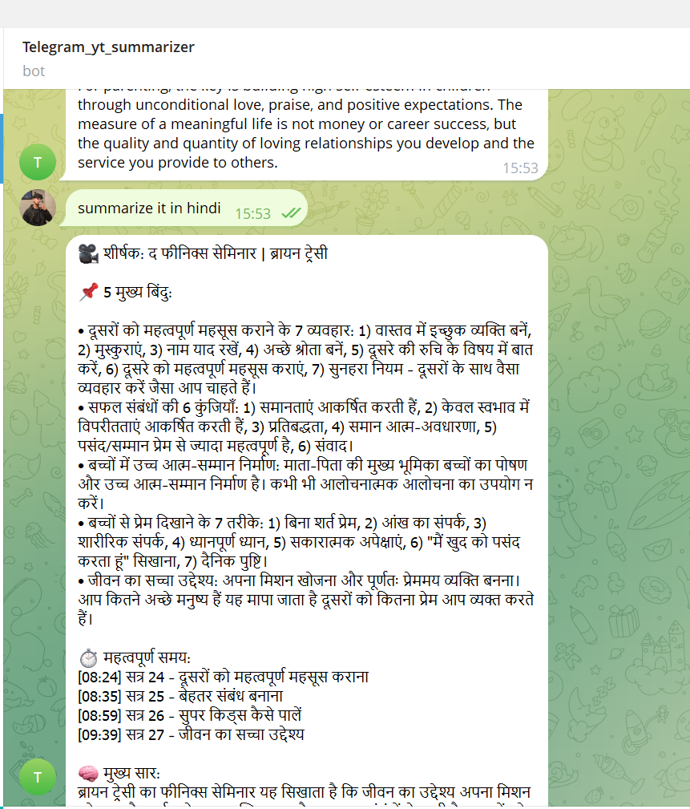
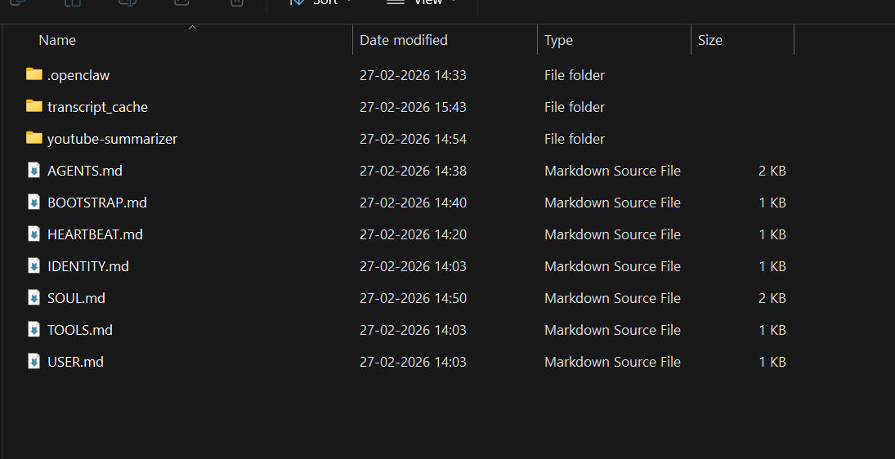
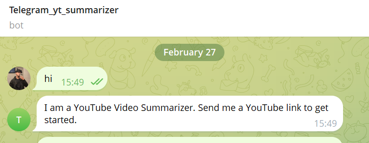

# 🎥 Agentic YouTube Summarizer & Q&A Telegram Bot

> 
> [***[ 📺 CLICK HERE TO WATCH THE SHORT DEMO VIDEO ]***](https://youtu.be/cKOPa4292lM)

---

## 📌 Project Objective

A production-ready Telegram assistant built to revolutionize video research. Unlike traditional bots, this system utilizes an **Agentic AI Architecture** to autonomously fetch transcripts, generate structured summaries, and provide grounded Q&A. It is engineered for **high token efficiency**, **zero hallucinations**, and **multi-lingual support** (including native English and Hindi capabilities).

---

## 🏗️ Architecture Explanation

The project is built on a **decoupled, three-tier architecture**:

| Layer | Component | Role |
|---|---|---|
| **Orchestration** | OpenClaw | Acts as the "Brain" — handles Telegram webhook polling, maintains session state, and routes user intent (`/deepdive`, `/summary`, `/actionpoints`) to appropriate tools |
| **Logic** | Python Skill | A custom-built execution engine (`fetch_transcript.py`) that handles data extraction, converts YouTube URLs into searchable text, automatically pulls dual-language subtitles (English/Hindi), caches transcripts, and applies Token Optimization before passing data to the LLM |
| **Intelligence** | Minimax 2.5 | A high-reasoning LLM that interprets the transcript. Through strict Persona Engineering (`SOUL.md`), the model is constrained to only provide info from the transcript, preventing general-knowledge hallucinations and adapting its output format dynamically to the issued command. |

> 💡 **Key Architectural Win:** By using an agentic framework, I eliminated the need for complex, thread-blocking Python dictionaries to manage user sessions. OpenClaw provides native, isolated session memory per user.

---

## 🚀 Setup Steps

### 1. Backend Environment

```bash
# Clone and enter the repo
cd Telegram-Youtube-Summarizer-Bot

# Create virtual environment
python -m venv venv
source venv/bin/activate   # or venv\Scripts\activate on Windows

# Install dependencies
pip install -r requirements.txt
```

### 2. OpenClaw Configuration

```bash
# Install OpenClaw globally or in your env
pip install openclaw

# Initialize and link your Telegram Bot Token
openclaw onboard
```

### 3. Loading Agent Constraints and Skills
Once OpenClaw is initialized, register the custom scripts and persona files:

**Provide Agent Personality (Workspace):**
Copy all the markdown files from the `openclaw_agent_config/` directory into your active OpenClaw workspace (usually `~/.openclaw/workspace/` or `C:\Users\<user>\.openclaw\workspace\`). This applies the strict `SOUL.md` rules.

**Install the Custom Python Skill:**
1. Create a `youtube-summarizer` directory inside your OpenClaw skills folder: `~/.openclaw/skills/youtube-summarizer/`
2. Copy `fetch_transcript.py` and `SKILL.md` from this repository into that newly created OpenClaw skill directory.

### 4. Run the Bot

```bash
# Start the OpenClaw active gateway (requires administrator terminal on Windows)
openclaw gateway start
# Alternatively, run interactively: openclaw gateway run
```

---

## ⚖️ Design Trade-offs & Engineering Decisions

### 1. Agentic vs. Monolithic (The "Why")
- **Decision:** Chose an agentic framework (OpenClaw) over a standard `python-telegram-bot` script.
- **Trade-off:** While a standard script is easier to write initially, an agentic structure allows for "Tool Calling." This makes the system modular — adding new capabilities requires no changes to the core bot logic, and session state is handled securely out-of-the-box.

### 2. Local Caching vs. Fresh Fetching
- **Decision:** Implemented a local JSON-based caching layer in `fetch_transcript.py`.
- **Trade-off:** This consumes minimal disk space while providing near-instant responses for popular videos and protecting the bot from being rate-limited by YouTube's API.

### 3. Dynamic Formatting Overrides
- **Decision:** Removed hardcoded system prompts from the Python data fetcher and moved formatting authority entirely to `SOUL.md`.
- **Trade-off:** Allows the LLM to flexibly provide distinct outputs (`/summary`, `/deepdive`, `/actionpoints`) depending on user intent, without breaking the foundational rules against hallucination.

---

## 🌟 Bonus Features Implemented

| Feature | Description |
|---|---|
| 🗄️ **Smart Caching** | Avoids redundant API calls by storing transcripts locally by Video ID (`transcript_cache/` folder) |
| 🌍 **Multi-Lingual Subtitles** | `fetch_transcript.py` will automatically attempt to fetch English & Hindi subtitle streams natively |
| ⚡ **Token Efficiency** | Implements a 15,000-character hard truncation limit to prevent LLM context overflow and minimize API costs |
| 🔒 **Context Isolation** | Explicit rules in `SOUL.md` force the AI to "forget" previous video context when a new URL is provided, preventing cross-video hallucinations |
| 🎛️ **Multi-Command Support** | Flexibly supports `/summary`, `/deepdive`, and `/actionpoints` with distinct formatting layouts |

---

## 📸 Screenshots

### 1. Grounded Q&A (No Hallucinations)

> The bot pulls exact quotes and explains metaphors based strictly on the transcript context, avoiding any external hallucinations.

### 2. Multi-Lingual Summary

*(Insert your Screenshot of the Kannada Summary here)*
> Demonstrates the bot's ability to maintain strict formatting while translating technical content into regional Indian languages.

### 3. Agentic Workspace Structure

> Shows the clean separation of concerns within the OpenClaw workspace, including custom persona files (`SOUL.md`, `IDENTITY.md`) and the transcript cache.

### 4. Strict Persona Rejection

> Proves the success of the Persona Engineering (`SOUL.md`), where the bot refuses to answer general knowledge questions outside its defined scope.

---

## 🛠️ Tech Stack

| Category | Technology |
|---|---|
| **Language** | Python 3.10+ |
| **Framework** | OpenClaw (Agentic Orchestration) |
| **LLM** | Minimax 2.5 |
| **Libraries** | `yt-dlp`, `youtube-transcript-api` |
| **Channel** | Telegram API |
